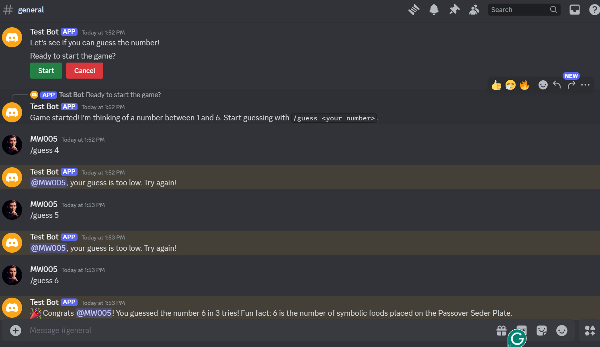
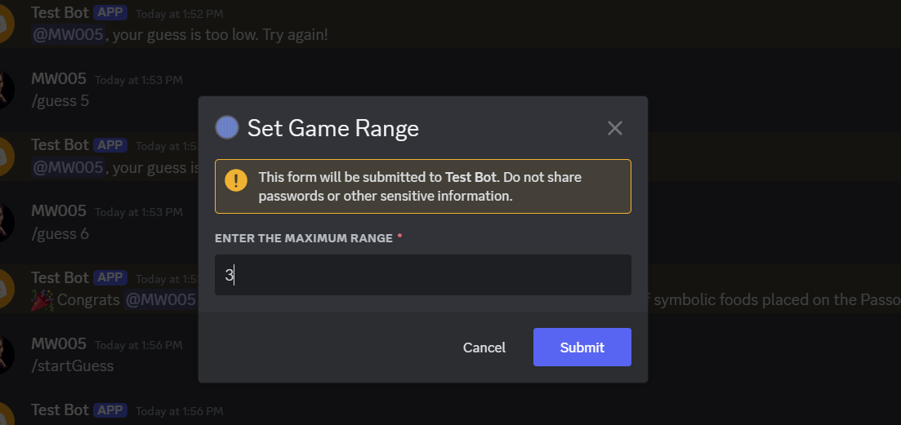
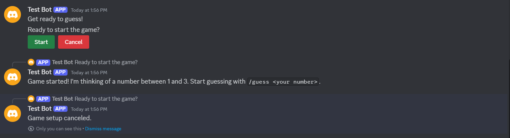

# Discord Number Guessing Game Bot

This repository contains the code for a Discord bot that plays a number guessing game with users. The bot generates a random number, and users have to guess it within a certain number of tries.

## Project Overview

This Discord bot provides an interactive number guessing game experience.  Users can use commands to start a new game, make guesses, and check their progress. The bot provides feedback on guesses (too high, too low, correct) and keeps track of the number of attempts.

## Features

* **New Game:** Starts a new number guessing game.
* **Guessing:** Allows users to input their guesses.
* **Feedback:** Provides feedback on each guess (too high, too low, correct).
* **Attempt Tracking:** Keeps track of the number of attempts made by the user.
* **Game Over:** Ends the game when the user guesses correctly or runs out of tries.

## Prerequisites

Before running the bot, ensure you have the following installed:

* Python 3.x
* Other dependencies listed in `requirements.txt`

## Installation

1. **Clone the Repository:**
   ```bash
   git clone [https://github.com/your-username/your-repo-name.git](https://github.com/your-username/your-repo-name.git)
Install Dependencies:

Bash

cd your-repo-name 
pip install -r requirements.txt

Create a Discord Bot Account:

Go to the Discord Developer Portal.
Create a new application and add a bot to it.
Copy the bot token.
Configure the Bot:

Create a .env file in the same directory as bot.py.
Add the following line to the .env file, replacing YOUR_BOT_TOKEN with your actual bot token:
DISCORD_TOKEN=YOUR_BOT_TOKEN
Running the Bot
Run the bot.py script:
Bash

python bot.py
Usage
Once the bot is running, you can add it to your Discord server and use the following commands:

/startGuess: Starts a new number guessing game.
/guess <number>: Makes a guess. Replace <number> with your guess.
Screenshots

  
 
 

Contributing
Contributions are welcome! Feel free to submit pull requests for bug fixes, new features, or improvements.

License
This project is licensed under the MIT License.

Contact
If you have any questions or feedback, please feel free to contact me.
